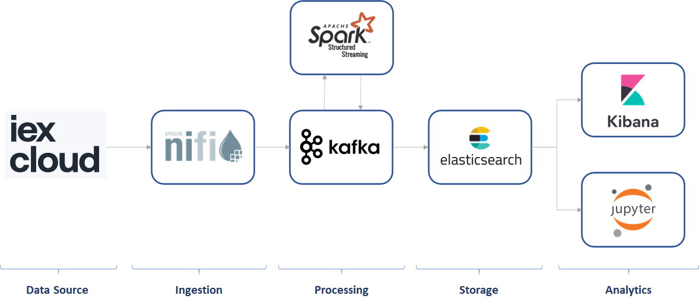

# ???Name of the course

Welcome to the "**???Course**" exercise.

In this exercise you will build a complete end-to-end Big Data Streaming Architecture, processing & analyzing data in real-time.
The below diagram provides a **high level view of the architecture**:

## Course outline

Follow the links below to access each exercise's details, code, etc.

* [**Exercise 0**: Setup](exercise0_setup)
* [**Exercise 1**: Data Ingestion](exercise1_data_ingestion)
* [**Exercise 2**: Data Processing](exercise2_data_processing)
* [**Exercise 3**: Data Storage](exercise3_data_storage)
* [**Exercise 4**: Data Visualization](exercise4_data_visualization)
* [**Exercise 5**: Machine Learning](exercise5_machine_learning)
* [**Post work**: Build you own flow](post_work)

## Infrastructure reference

| Component | Service | Description | URL/port |
| ------------- | ------------- | ------------- | ------------- |
| **Apache NiFi**  | nifi | Data Ingestion Tool  | http://localhost:8090/nifi  |
| **Confluent Kafka**  | broker | Message Broker  | localhost:9092  |
| **Confluent Control Center**  | control-center | Kafka Manager & Monitor  |  http://localhost:9021  |
| **Spark UI** | N/A | Spark UI (jobs, environment, etc.) | http://localhost:4040 |
| **Elasticsearch**  | elasticsearch | Data storage and search engine  | http://localhost:9200  |
| **Kibana**  | kibana | Dashboarding and Elasticsearch dev/admin tool  | http://localhost:5601  |
| **Jupyter**  | jupyter | Notebooks analytics  | http://localhost:8888  |
